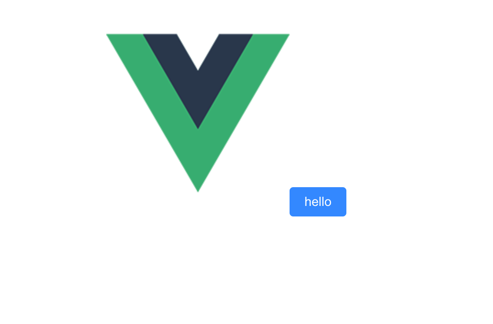

# 权限管理系统vue项目初始化
本章将介绍如何搭建基于vue框架的权限管理系统。首先需要安装 vue  , 具体安装命令如下。

```shell
npm install vue
```

在上述命令执行后等待若干分钟，在确认安装完毕后执行`vue --version`查看相关版本，本例所用版本为`@vue/cli 5.0.4` ，确认安装版本后在需要创建的文件夹下执行 `vue create rbac-vue`命令创建项目，执行上述命令后会在控制台出现如下内容。

```shell
Vue CLI v5.0.4
┌─────────────────────────────────────────┐
│                                         │
│   New version available 5.0.4 → 5.0.8   │
│    Run npm i -g @vue/cli to update!     │
│                                         │
└─────────────────────────────────────────┘

? Please pick a preset: (Use arrow keys)
❯ Default ([Vue 3] babel, eslint) 
  Default ([Vue 2] babel, eslint) 
  Manually select features 

```

选择 Vue3 然后输入回车键等待依赖下载，下载完成后会有如下目录内容
```shell
README.md       babel.config.js jsconfig.json   node_modules    package.json    public          src             vue.config.js   yarn.lock
```

看到上述目录内容后表示项目已经将项目初始化完成，接下来需要进入UI组件的引入，本项目UI组件选择的是Element-Plus，下面将这个依赖添加到本项目中，执行如下命令即可完成。

```shell
yarn add element-plus
```

完成依赖添加后需要将组件投入到vue项目的使用中，找到src目录下的main.js文件对他进行修改，修改后内容如下。


```js
import {createApp} from 'vue'
import App from './App.vue'
import ElementPlus from 'element-plus'
import 'element-plus/dist/index.css'

var elementApp = createApp(App);
elementApp.use(ElementPlus);
elementApp.mount('#app')
```

内容加入完成后需要开始第一个页面的编写，在vue项目创建完成后会自动生成一个页面，这个页面路径：`/src/components/HelloWorld.vue` 在这个页面中将template标签、style标签下的内容，清空后内容如下。
```vue
<template>

</template>

<script>
export default {
  name: 'HelloWorld',
  props: {
    msg: String
  }
}
</script>

<style scoped>
</style>

```

接下来在template标签中补充一段element的组件代码`<el-button type="primary">hello</el-button>`，然后进入项目路执行`npm run server`命令讲项目启动。启动后会在控制台看到如下内容
```shell

  App running at:
  - Local:   http://localhost:8080/ 
  - Network: http://192.168.31.87:8080/

  Note that the development build is not optimized.
  To create a production build, run yarn build.


```
通过浏览器访问http://localhost:8080/地址查看浏览器显示内容，具体如图所示



在该页面中出现了额外的VUE图标，这个图标的内容在`/src/App.vue`文件中，有相关定义，主要是在template标签中具体代码如下。

```
<template>
  
  <HelloWorld msg="Welcome to Your Vue.js App"/>
</template>
```

如果需要去掉vue图标可以将img标签删除，删除后保存App.vue文件在访问浏览器即可看到修改后的信息，具体内容如图所示


在vue项目初始化后会有基础样式提供，这部分样式是本项目中不需要的内容，将App.vue文件中style标签下的内容都删除即可得到没有样式的项目了。