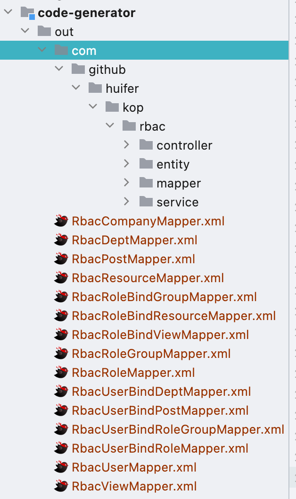

# 代码生成器

## 开发

本章将介绍如何使用代码生成器将数据库结构转换为Java类。因为项目采用mybatis框架作为ORM框架因此可以借用目前主流的代码生成器进行代码生成，本章选择的插件是mybatis-plus-generator。
使用mybatis-plus-generator进行代码生成需要使用到的依赖有如下内容。

```xml

<dependencies>
    <dependency>
        <groupId>com.baomidou</groupId>
        <artifactId>mybatis-plus-generator</artifactId>
        <version>3.5.2</version>
    </dependency>
    <dependency>
        <groupId>com.baomidou</groupId>
        <artifactId>mybatis-plus-boot-starter</artifactId>
        <version>3.5.2</version>
    </dependency>
    <dependency>
        <groupId>org.apache.velocity</groupId>
        <artifactId>velocity-engine-core</artifactId>
        <version>2.3</version>
    </dependency>
    <dependency>
        <groupId>mysql</groupId>
        <artifactId>mysql-connector-java</artifactId>
        <version>8.0.29</version>
    </dependency>
</dependencies>
```

在上述依赖项中需要注意mysql-connector-java依赖是变化的，这项依赖的具体选择是根据项目中所使用的数据库进行变化的，即数据库连接驱动依赖项，由于本项目采用MySQL作为数据库因此需要使用到mysql-connector-java依赖项。

在依赖项添加完成后需要编写一定的代码才可以生成代码，在这个代码生成器程序中为了提高重用性将配置信息进行抽离，主要抽离的配置包含如下内容。

1. url表示数据库连接地址
2. username表示数据库账号
3. password表示数据库连接密码
4. author表示生成作者
5. package表示生成的包路径
6. table表示需要生成的表
7. out_put_file表示输出文件位置

上述配置项采用properties文件进行存储，文件名为code-gen.properties。确定了配置项后接下来对代码生成器的开发进行说明，第一步需要将配置文件中的数据进行读取，相关读取代码如下。

```java
public static final String MYSQL_INFO = "code-gen.properties";

static String url;
static String username;
static String password;
static String author;
static String packageName;
static String table;
static String out_put_file;

static {
    InputStream in = CodeGenerator.class.getClassLoader().getResourceAsStream(MYSQL_INFO);
    Properties properties = new Properties();
    try {
        properties.load(in);
        url = properties.getProperty("url");
        username = properties.getProperty("username");
        password = properties.getProperty("password");
        author = properties.getProperty("author");
        packageName = properties.getProperty("package");
        table = properties.getProperty("table");
        table = properties.getProperty("table");
        out_put_file = properties.getProperty("out_put_file");


    } catch (IOException e) {
        throw new RuntimeException(e);
    }

}

```

配置文件可以通过上述代码进行获取，接下来需要编写生成器代码，具体代码如下。

```java
public static void main(String[] args) {
    FastAutoGenerator.create(url, username, password)
    .globalConfig(
    (scanner, builder) -> builder.author(author).fileOverride()
    .outputDir(out_put_file)
    )
    .packageConfig((scanner, builder) -> builder.parent(packageName)
    .pathInfo(Collections.singletonMap(OutputFile.xml, out_put_file))) // mapper xml 文件生产地址

    .strategyConfig((scanner, builder) -> builder.addInclude(getTables(table))
    .controllerBuilder().enableRestStyle().enableHyphenStyle()
    .entityBuilder().enableLombok()
    .enableTableFieldAnnotation()
    .addTableFills(
    new Column("create_time", FieldFill.INSERT),
    new Column("create_user_id", FieldFill.INSERT),
    new Column("update_time", FieldFill.INSERT_UPDATE),
    new Column("update_user_id", FieldFill.INSERT_UPDATE)

    ).build())
    .execute();


}

protected static List<String> getTables(String tables) {
    return "all".equals(tables) ? Collections.emptyList() : Arrays.asList(tables.split(","));
}
```

上述程序全类名为com.github.huifer.codegenerator.CodeGenerator，可以在code-generator项目中找到具体代码。


## 测试
经过前文操作以及完成代码生成器的初始化，接下来通过配置code-gen.properties文件并执行CodeGenerator类，然后查看生成的结果数据。修改后的code-gen.properties文件如下

```properties
url=jdbc:mysql://localhost:3306/rbac?useSSL=false&serverTimezone=UTC&characterEncoding=utf-8
username=root
password=root123@
author=root
package=com.github.huifer.kop.rbac
table=all
out_put_file=/Users/zhangsan/git_repo/kop/code-generator/out
```

配置完成后执行CodeGenerator类即可生成相关代码，生成的代码有如下几种。
1. controller，接口
2. entity：数据库实体
3. mapper：Mybatis中的Mapper接口
4. service：服务接口

执行完成CodeGenerator类后具体产出文件内容如图所示


